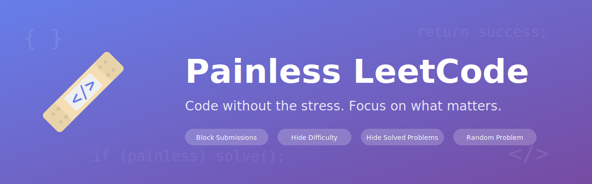

  

  
  
  
  
  

# Painless LeetCode

A browser add-on that aims to make LeetCode a bit more painless. This entire project has been vibe-coded based on things that I needed to make my experience smoother, but its might be useful to you as well.

## LeetCode

LeetCode is a website that offers a variety of coding problems and a platform to practice them. While I love LeetCode, I sometimes wish some of its features did not exist in the first place.

## Add-on Features

- **Disable Ctrl+Enter shortcut** - Prevents accidental code submissions and helps maintain your acceptance rate.
- **Hide difficulty labels** - Hides Easy/Medium/Hard badges to prevent bias when attempting problems.
- **Hide solved problems** - Hides already-solved problems from the problem list so you can focus on new challenges.
- **Random problem button** - Click the extension icon in your browser toolbar to jump to a random problem.

This project is currently in development so feature set is limited. Please file a PR or an issue if you have any suggestions.

## How to install from source

### Firefox

1. Open Firefox and navigate to `about:debugging`
2. Click **"This Firefox"** in the left sidebar
3. Click **"Load Temporary Add-on..."**
4. Navigate to the extension folder and select `manifest.json`
5. The extension is now active (note: temporary add-ons are removed when Firefox closes)

### Chrome

1. Open Chrome and navigate to `chrome://extensions`
2. Enable **"Developer mode"** (toggle in the top-right corner)
3. Click **"Load unpacked"**
4. Select the extension folder
5. The extension is now active

### Edge

1. Open Edge and navigate to `edge://extensions`
2. Enable **"Developer mode"** (toggle in the left sidebar)
3. Click **"Load unpacked"**
4. Select the extension folder
5. The extension is now active

> **Note:** Extensions loaded from source need to be reloaded after code changes. In Firefox, use the "Reload" button in `about:debugging`. In Chrome/Edge, click the refresh icon on the extension card.

## License

This project is licensed under the MIT License. See the [LICENSE](LICENSE) file for details.

## Contact

The best way to contact me with feedback is to file an issue on this repository.
